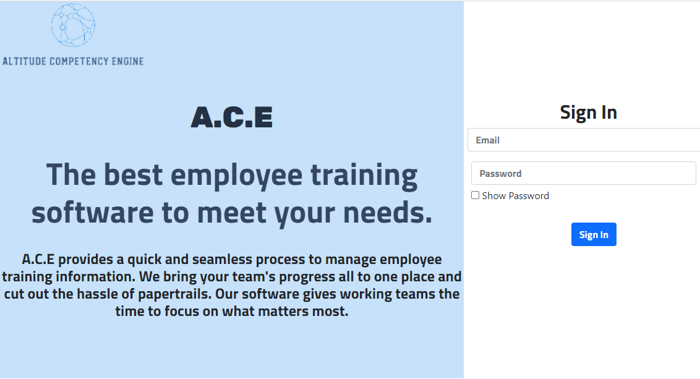
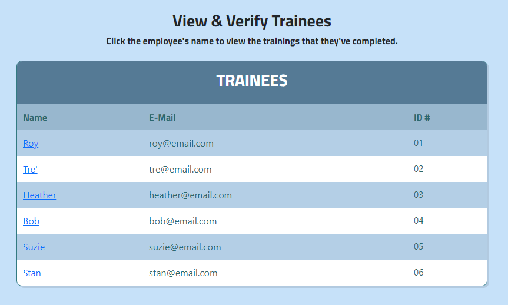
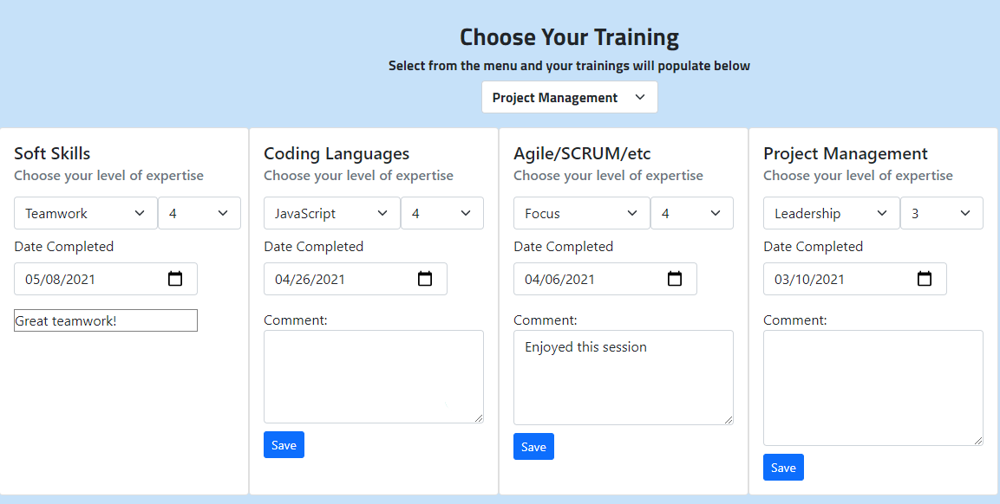

# ACE

OSU Full Stack Coding Bootcamp Project 2 - Altitude Competency Engine (ACE)
MVC - Sequelize - Handlebars - PDFKit - Express - Express-Session - BCRYPT - CSS/SCSS - DOTENV - JS

---

## Description

Running a business is hard work. There are tons of moving parts and any successful business will eventually need to hire employees.
Good businesses will often require their employees to be trained in several areas to be good at their jobs. It can be tough keeping track of the trainings that each employee has done, and this is where ACE steps in.

Our software allows companies to track their team’s training progress all in one place. ACE takes away the headache of keeping a paper trail and gives employees more time to focus on the work that they love.

\
\

---

## Installation

In order to use the ACE application locally, you will want to:

1. Use the Command Prompt or the VS Terminal to install needed npm node packages:

- Run 'npm i' to pull down the npm package manager.
- Make sure to run npm if all other packages as needed (dotenv, PDFKit, sequelize, handlebars, mysql2, etc.)

2. Update the .env file with databased, username, and password.
3. Open the main folder in Command Prompt or VS Terminal.
4. Open MySQL Workbench and run the schema db file to create the needed database.
5. Run node seeds/seed.js to create the tables and insert initial data.
6. Run 'npm start' in either the Command Prompt or VS Terminal to start the server.
7. Navigate to the localhost URL and enjoy.

---

## Usage

ACE can be used with permission.\
[This program can be used in Heroku](https://nameless-thicket-55768.herokuapp.com/)

---

## License

---

## Contact

If you have any questions, you can contact us at:\

Heather Koren\
✉️[Email](mailto:hrkoren@gmail.com)\
📂[GitHub](https://github.com/hrkoren)

Trey Scott\
✉️[Email]
📂[GitHub]

Roy Sizemore\
✉️[Email](mailto:sizemore.coding@gmail.com)\
📂[GitHub](https://github.com/roy-sizemore)
